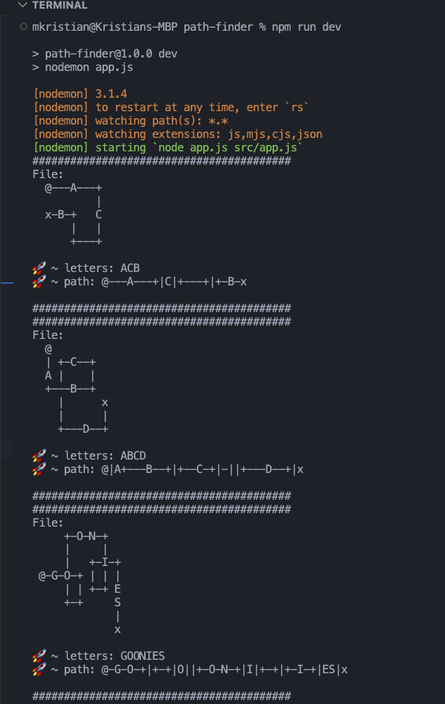

# Maze Solver

## Overview

This project provides a solution for solving mazes from text files.
The maze is represented as a grid where specific characters denote the start, end, and paths.
The application reads multiple maze files, processes each maze, and finds the path from the start to the end, if it exists.

## Features

- **Maze Parsing:** Converts a maze from a string format into a 2D array.
- **Maze Solving:** Implements an algorithm to find the path in the maze.
- **Path Formatting:** Provides a readable format of the solution path, including the sequence of characters and directions.

## Project Structure

- `data/`: Contains the maze files (`1.txt`, `2.txt`, etc.).
- `util/index.js`: Utility functions such as `readFile` and `parse2DString`.
- `MazeSolver.js`: The main class responsible for solving the maze.
- `app.js`: The entry point script that reads the maze files, solves them, and prints the results.

## Installation

1. Clone the repository:
   ```bash
   git clone https://github.com/your-username/maze-solver.git
   cd maze-solver
   ```
2. Install dependencies
   ```
   npm install
   ```
3. Run the application:
   ```
   npm run dev
   ```
4. Run the tests
   ```
   npm test
   ```

## Screenshots



